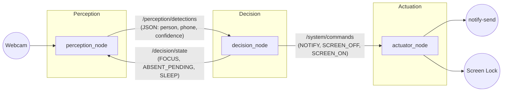
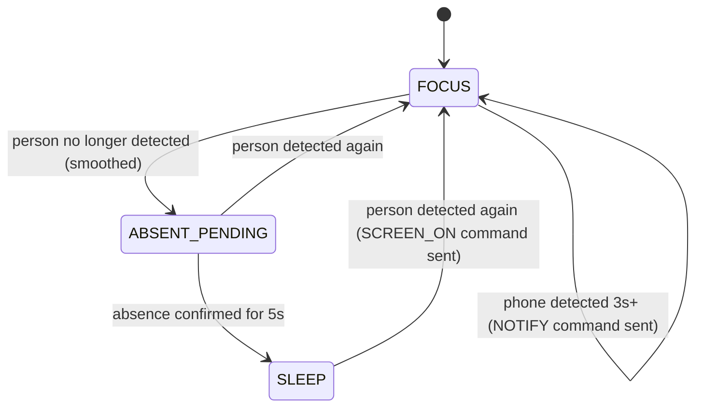

# Desk Supervisor

A ROS2-based desktop supervision system that uses computer vision to monitor presence and phone usage, automatically managing focus notifications and screen power state.

## Overview

Desk Supervisor watches a desk setup through a webcam and reacts to two situations:

- **You're holding your phone at your desk** → after a configurable delay, it sends a focus reminder notification.
- **You've left your desk** → after a configurable delay, it locks the screen. When you come back and interact with the keyboard, the normal GNOME lock screen takes over (password required) — the system intentionally does **not** bypass this security step.

The project is built as a small distributed robotics system using ROS2, following a Perception → Decision → Actuation architecture rather than a single monolithic script.

## Motivation

This project started as a way to apply core robotics engineering practices — distributed node design, sensor data filtering, and finite state machines — to a practical, everyday problem, rather than as a purely academic exercise.

## Architecture

The system is split into three independent ROS2 nodes communicating over topics.



### 1. `perception_node`

- Captures frames from the webcam via OpenCV
- Runs YOLOv8n (Ultralytics) inference on each frame, restricted to the `person` and `cell phone` COCO classes
- Publishes detection results as JSON on `/perception/detections`
- Subscribes to `/decision/state` to overlay the current FSM state on the live video feed (for debugging/demo purposes)

### 2. `decision_node`

- Subscribes to `/perception/detections`
- Applies a **sliding window smoothing** filter (last 10 detections, 30% positive-ratio threshold) to avoid reacting to single missed or noisy frames
- Implements a finite state machine with three states: `FOCUS`, `ABSENT_PENDING`, `SLEEP`
- Publishes actions to `/system/commands` and the current state to `/decision/state`

**State diagram:**



### 3. `actuator_node`

- Subscribes to `/system/commands`
- Executes the corresponding system action:
  - `NOTIFY` → desktop notification via `notify-send`
  - `SCREEN_OFF` → locks the session via `gdbus` (`org.gnome.ScreenSaver.SetActive true`)
  - `SCREEN_ON` → sends a "welcome back" notification only (screen wake/unlock is intentionally left to physical user input for security)

## Tech Stack

- **ROS2 Humble**
- **Python 3.10**
- **Ultralytics YOLOv8n** (CPU inference)
- **OpenCV**
- Target platform: Ubuntu + GNOME + Wayland

## Prerequisites

- ROS2 Humble installed and sourced
- Python 3.10
- A working webcam
- `notify-send` (usually provided by `libnotify-bin`)
- GNOME desktop environment (the screen-lock mechanism is GNOME-specific — see [Known Limitations](#known-limitations))

## Installation

```bash
# Clone into your ROS2 workspace
cd ~/Projects/Desk_supervisor/src
git clone https://github.com/peace-fiacre/desk_supervisor 

# Install Python dependencies (CPU-only PyTorch to avoid pulling CUDA packages)
pip install ultralytics opencv-python \
    --index-url https://download.pytorch.org/whl/cpu \
    --extra-index-url https://pypi.org/simple \
    --break-system-packages

# Build the package
cd ~/Projects/Desk_supervisor
colcon build --packages-select desk_supervisor
source install/setup.bash
```

> **Note:** on first run, `ultralytics` automatically downloads the YOLOv8n weights (`yolov8n.pt`, ~6 MB).

## Usage

Launch all three nodes at once:

```bash
source install/setup.bash
ros2 launch desk_supervisor desk_supervisor_launch.py
```

Or run each node individually (useful for isolated debugging):

```bash
ros2 run desk_supervisor perception_node
ros2 run desk_supervisor decision_node
ros2 run desk_supervisor actuator_node
```

Watch the FSM state directly on a topic:

```bash
ros2 topic echo /decision/state
```

## Configuration

Key tunable parameters currently live as constants in `decision_node.py` and `perception_node.py`:

| Parameter | File | Default | Description |
|---|---|---|---|
| `conf` (YOLO confidence threshold) | `perception_node.py` | `0.70` | Minimum detection confidence accepted |
| `SEUIL_NOTIF_TELEPHONE` | `decision_node.py` | `3.0s` | Time holding phone before a focus notification |
| `SEUIL_ABSENCE_VEILLE` | `decision_node.py` | `5.0s` | Time absent before the screen locks |
| `TAILLE_FENETRE` | `decision_node.py` | `10` | Sliding window size (number of recent detections) |
| `SEUIL_RATIO` | `decision_node.py` | `0.30` | Minimum positive-detection ratio to consider "present" |

These values were chosen as a starting point and are expected to be tuned based on real usage (lighting conditions, desk position, camera angle).

## Known Limitations

- **CPU-only inference**: measured at ~10 FPS on an HP EliteBook 850 G5, no GPU used. This is sufficient for presence/phone detection but not for smooth real-time tracking.
- **Screen wake is not automated by design**: under GNOME/Wayland, there is no reliable, documented way to programmatically unlock a session without user input — and this project intentionally keeps it that way for security (physical key press + password required to resume).
- **GNOME/Wayland-specific**: the screen-lock mechanism relies on `org.gnome.ScreenSaver` via D-Bus. It has not been tested on other desktop environments or on X11.
- **Detection reliability depends on lighting and camera angle**: false negatives can occur in poor lighting, which is why the sliding-window smoothing was introduced.
- **ROS2 on a single machine**: this project uses ROS2's distributed-node philosophy for architectural clarity and reusability (the perception/decision/actuation split could be reused on an actual robot), even though it currently runs on a single machine, where the distribution benefit isn't the main driver.


## Project Structure

```
Desk_supervisor/
├── build/                          # colcon build artifacts (not versioned)
├── install/                        # colcon install artifacts (not versioned)
├── log/                            # colcon logs (not versioned)
├── src/
│   └── desk_supervisor/
│       ├── desk_supervisor/
│       │   ├── __init__.py
│       │   ├── actuator_node.py
│       │   ├── decision_node.py
│       │   └── perception_node.py
│       ├── launch/
│       │   └── desk_supervisor_launch.py
│       ├── resource/
│       ├── test/
│       ├── package.xml
│       ├── setup.cfg
│       ├── setup.py
│       ├── test_yolo.py            # standalone YOLO test script (Phase 1)
│       ├── yolov8n.pt              # downloaded YOLO weights (not versioned)
│       └── .gitignore
└── README.md
```

## Roadmap

- [x] Environment setup
- [x] Standalone YOLO detection script
- [x] `perception_node` (ROS2 + YOLO + webcam)
- [x] `decision_node` (finite state machine with sliding-window smoothing)
- [x] `actuator_node` (notifications + screen lock)
- [x] Full integration via a single `ros2 launch` file
- [ ] Real-world threshold tuning based on multi-day usage
- [ ] Optional: configurable parameters via ROS2 launch arguments instead of hardcoded constants

## Author

Peace Fiacre — Electrical Engineering student (Robotics, Embedded Systems & AI), EPAC, Université d'Abomey-Calavi, Bénin.
